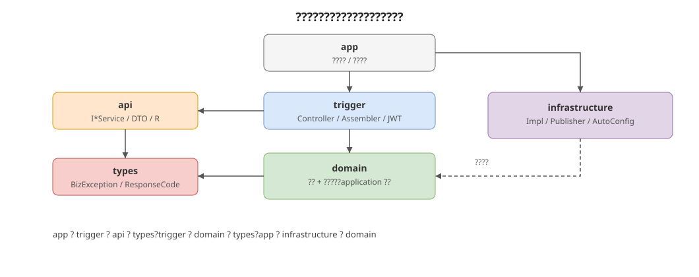

# hei-ddd-ai-lite

个人 **AI demo 开发脚手架**：DDD 分层约定 + Spring Boot 4 / Spring AI 2 + MySQL / Redis + 简易账户体系 + Vue 前台/后台分离。  
坐标：`io.github.jiangbyte` / `io.github.jiangbyte.hei.*`。

适合在本地快速起一个可登录、可扩展 Agent 能力的 demo，而不是完整 AI 平台。

**做齐：** Entity、ValueObject、AggregateRoot（含事件登记）、DomainEvent、DomainEventPublisher、Repository、DomainService、Factory、Specification、ApplicationService、Command / Query、分层依赖倒置；用户注册登录（PORTAL / ADMIN）；Spring AI 依赖接入；Portal / Admin 前端。  
**刻意不做：** Event Sourcing、Saga、强制 CQRS 总线、ACL、多限界上下文拆分、细粒度 RBAC、生产级多租户。

架构图源文件见 [`docs/diagrams/*.drawio`](docs/diagrams/)（可用 [diagrams.net](https://app.diagrams.net/) 打开编辑）；README 嵌入对应 SVG。前端说明见 [`web/README.md`](web/README.md)。

---

## 1. 模块结构

```text
hei-ddd-ai-lite/
├── domain/            # 领域内核（无 Spring）
├── application/       # 用例编排 / Command / Query
├── interfaces/        # Controller / DTO / JWT / 统一响应
├── infrastructure/    # 仓储实现 / 事件发布 / MySQL·Redis 等
├── bootstrap/         # 启动入口与 application.yml
├── web/               # Vue3 pnpm monorepo（portal / admin / shared）
└── docs/              # SQL、架构图
```

---

## 2. 模块与分层架构



| 层 | 放什么 | 不放什么 |
|----|--------|----------|
| domain | 实体/聚合、值对象、领域事件、仓储端口、工厂、规约、领域服务、领域异常 | Spring、HTTP、SQL |
| application | 用例编排、事务边界、Command/Query、应用读模型 | 对外 API DTO、技术细节 |
| interfaces | Controller、Response、Assembler、统一响应 `R`、`@RequireLogin` / `@RequireAdmin` / JWT | 业务规则、持久化 |
| infrastructure | 仓储实现、事件发布、Druid / MyBatis-Plus / Redis 等 | 领域规则 |
| bootstrap | 启动类、`application.yml`、组件扫描范围 | 业务逻辑 |

依赖方向（**不可反向**）：

```text
bootstrap → interfaces → application → domain
bootstrap → infrastructure → domain / application
```

JWT / CORS 属于 **interfaces**；数据源 / MyBatis / Redis / S3 / Milvus 属于 **infrastructure**。

---

## 3. DDD 核心概念


| 抽象 | 包位置 | 扩展时怎么用 |
|------|--------|----------------|
| `Entity` | `domain.core` | 有标识、可变；按 ID 相等 |
| `ValueObject` | `domain.core` | 不可变、按值相等；参考 `Greeting` |
| `AggregateRoot` | `domain.core` | 继承它；行为内 `registerEvent` |
| `DomainEvent` | `domain.core` | 不可变事实；参考 `HelloCreatedEvent` |
| `DomainEventPublisher` | `domain.core` | 领域端口；infra 提供 `SpringDomainEventPublisher` |
| `Repository` | `domain.core` | 以聚合为粒度；端口在 domain，实现在 infra |
| `Factory` | `domain.core` | 创建合法聚合；参考 `HelloFactory` |
| `Specification` | `domain.core` | 可复用判定；参考 `GreetingNotBlankSpecification` |
| `DomainService` | `domain.core` | 跨聚合无状态规则；单聚合行为放聚合根 |
| `ApplicationService` | `application.core` | 编排用例 + `@Transactional` |
| `Command` / `Query` | `application.core` | 写/读用例入参 |

包级约定见各模块 `package-info.java`。

---

## 4. 账户体系

| 类型 | 说明 |
|------|------|
| `PORTAL` | 前台用户；公开注册创建；只能登录 Portal |
| `ADMIN` | 后台管理员；种子或后台创建；只能登录 Admin |

主要接口：

| 方法 | 路径 | 说明 |
|------|------|------|
| POST | `/auth/register` | 注册 PORTAL 用户 |
| POST | `/auth/login` | 登录（body 需 `clientType`: `PORTAL` / `ADMIN`） |
| POST | `/auth/logout` | 登出（JWT 进 Redis 黑名单） |
| GET | `/auth/me` | 当前登录用户（需登录） |
| GET | `/users/{id}` | 公开资料（启用中的 PORTAL） |
| GET/POST | `/admin/users` | 后台用户管理（需 ADMIN） |

建表脚本：[`docs/sql/schema-user.sql`](docs/sql/schema-user.sql)  
默认管理员：`admin` / `admin123`

时间字段 JSON 输出格式：`yyyy-MM-dd HH:mm:ss`。

---

## 5. 基于本脚手架开发


按 Hello 占位竖切复制，或在其上扩展 Agent / 会话等 AI demo 能力：

1. **领域模型**（`domain.model`）：新建聚合继承 `AggregateRoot`，值对象实现 `ValueObject`。
2. **Factory / Event / Spec**（`domain.factory` / `event` / `specification`）：创建时校验并登记创建事件。
3. **Repository 端口**（`domain.repository`）：`XxxRepository extends Repository<Xxx, ID>`。
4. **应用服务**（`application`）：`CreateXxxCommand` / `GetXxxQuery` + `XxxApplicationService`（事务边界）。
5. **基础设施**（`infrastructure.persistence` / `event`）：实现仓储与事件发布；对接 Spring AI 客户端等。
6. **接口**（`interfaces.web`）：Controller + Assembler + Response。
7. **启动**：若新增需扫描的 infra 包，更新 `HeiDddAiLiteApplication` 的 `scanBasePackages`。

### 领域事件约定


1. 聚合行为内 `registerEvent(...)`。
2. 应用服务 `repository.save(aggregate)`。
3. `aggregate.pullDomainEvents()` 取出并清空。
4. `domainEventPublisher.publish(events)`。

事务边界在**应用服务**；默认同步 Spring 事件发布，可替换为 Outbox / MQ。

### 何时用 DomainService / Factory / Specification

- **Factory**：构造复杂或必须保证不变式的聚合创建。
- **Specification**：多处复用的业务判定，避免散落 if。
- **DomainService**：规则不属于单一聚合（跨聚合协作），且仍是纯领域逻辑。

---

## 6. 快速启动

### 前置

- **JDK 21**
- **MySQL**（库名 `hei`，默认账号见 `application.yml`）
- **Redis**（默认密码见 `application.yml`）
- 执行 [`docs/sql/schema-user.sql`](docs/sql/schema-user.sql)

本地默认密码示例：`infra123!`（与 `bootstrap/src/main/resources/application.yml` 一致，可按环境修改）。

### 后端

```bash
export JAVA_HOME=/path/to/jdk-21
export PATH="$JAVA_HOME/bin:$PATH"

mvn -pl bootstrap -am package -DskipTests
java -jar bootstrap/target/bootstrap-1.0-SNAPSHOT.jar
```

服务：`http://127.0.0.1:8080`  
API 文档：`http://127.0.0.1:8080/doc.html`（OpenAPI：`/v3/api-docs`）

登录示例（前台用户）：

```bash
curl -s -X POST http://127.0.0.1:8080/auth/login \
  -H 'Content-Type: application/json' \
  -d '{"username":"your_portal_user","password":"******","clientType":"PORTAL"}'
```

后台管理员登录将 `clientType` 改为 `ADMIN`。

Hello 占位仍可用：

```bash
curl http://127.0.0.1:8080/hello
```

### 前端

详见 [`web/README.md`](web/README.md)：

```bash
cd web && pnpm install
pnpm dev:portal   # http://127.0.0.1:5173
pnpm dev:admin    # http://127.0.0.1:5174
```

---

## 7. 基础设施

MySQL（Druid + MyBatis-Plus）与 Redis **默认启用**。S3 / Milvus 按开关启用。开关见 `application.yml` 中 `hei.ddd.*`。

| 能力 | 说明 |
|------|------|
| 数据源 | Druid + MySQL，`hei.ddd.datasource.enabled` |
| MyBatis-Plus | 分页 / 元数据填充，`hei.ddd.mybatis.enabled` |
| Redis | JWT 黑名单等，`hei.ddd.redis.enabled` |
| JWT | 内置于 interfaces，`hei.ddd.jwt.enabled` |
| S3 | AWS SDK v2（兼容 AWS S3 / MinIO / R2 等），`hei.ddd.s3.enabled`；注入 `S3Client` / `S3ObjectStorage` |
| Milvus | 向量库（milvus-sdk-java），`hei.ddd.milvus.enabled`（本地默认 `false`，起好服务后打开） |
| Knife4j | API 文档（Boot4 专用 `knife4j-openapi3-boot4-spring-boot-starter`），访问 `/doc.html` |
| Spring AI | BOM + ollama starter；默认 `http://127.0.0.1:11434`，可用 `OLLAMA_BASE_URL` / `OLLAMA_CHAT_MODEL` / `OLLAMA_EMBEDDING_MODEL` 覆盖 |

启用 Milvus 后可注入 `MilvusClientV2` 或 `MilvusOperations`。默认连接：`http://127.0.0.1:19530`。

版本在父 POM `<properties>` 中用 `${xxx.version}` 统一管理。

---

## 8. 「不做」清单

- 不做 Event Sourcing / 事件溯源存储
- 不做 Saga / 流程编排框架
- 不做强制 CQRS 总线（Command/Query 仅为入参约定）
- 不做 ACL / 防腐层脚手架
- 不做多限界上下文工程拆分
- 不做细粒度 RBAC（仅 PORTAL / ADMIN 端类型隔离）
- 不做生产级多租户 / 计费 / 模型路由平台

---

## 技术栈

- Java 21 / Spring Boot 4.1.x / Spring AI 2 / Maven 多模块
- Lombok / Hutool / MapStruct / JJWT / BCrypt
- Druid / MyBatis-Plus / Redis（默认）；S3 / Milvus（开关启用）
- Vue 3 / Vite / TypeScript / Pinia / Vue Router / Naive UI / pnpm workspace
